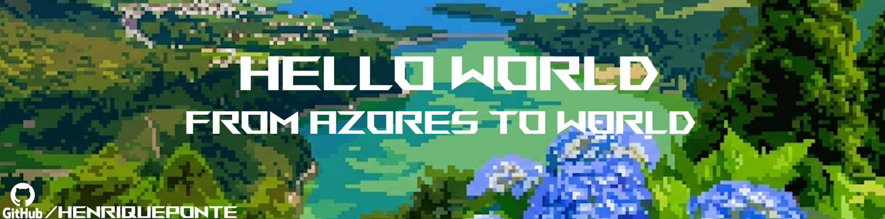

<!--Banner-->

<!--Header Name-->
#  Hi, I'm Henrique Ponte 
*Digital Craftsman (Developer)*
  

I'm a passionate **Software Developer** focused on building scalable, efficient, and high-quality applications.  
With experience across **frontend**, **backend**, and **IoT-related systems**, I enjoy designing modern digital solutions — from mobile apps to backend infrastructures.

---

## 📊 GitHub Stats

---

## 📫 Contact

- 💬 Open to collaboration and innovative projects  
- 🌐 [LinkedIn]([https://www.linkedin.com/in/henriqueponte](https://www.linkedin.com/in/henrique-ponte-818982276/))
- ✉️ Email: *[henriquemedeirosponte@gmail.com]*  

---

> *“Code is like energy — efficient when optimized, powerful when well-directed.”* ⚡
