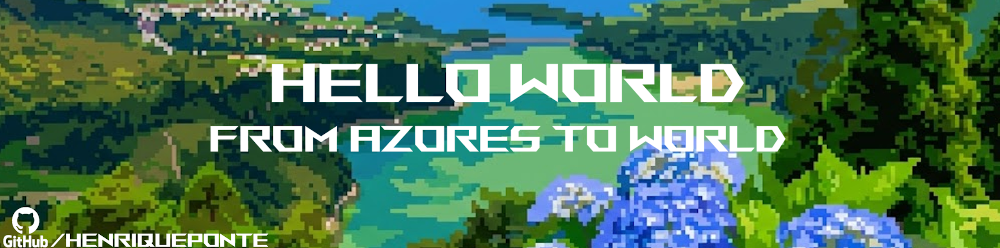

<!--Banner-->

  

<!--Header Name-->
#  Hi, I'm Henrique Ponte 
*Digital Craftsman (Developer)*

  
  

I'm a passionate **Software Developer** focused on building scalable, efficient, and high-quality applications.  
With experience across **frontend**, **backend**, and **IoT-related systems**, I enjoy designing modern digital solutions — from mobile apps to backend infrastructures.

---

  
  

---

> *“I enjoy creating and modifying things — sometimes games end, other times there are even leftover pieces.”* 
